# Pillar & Post

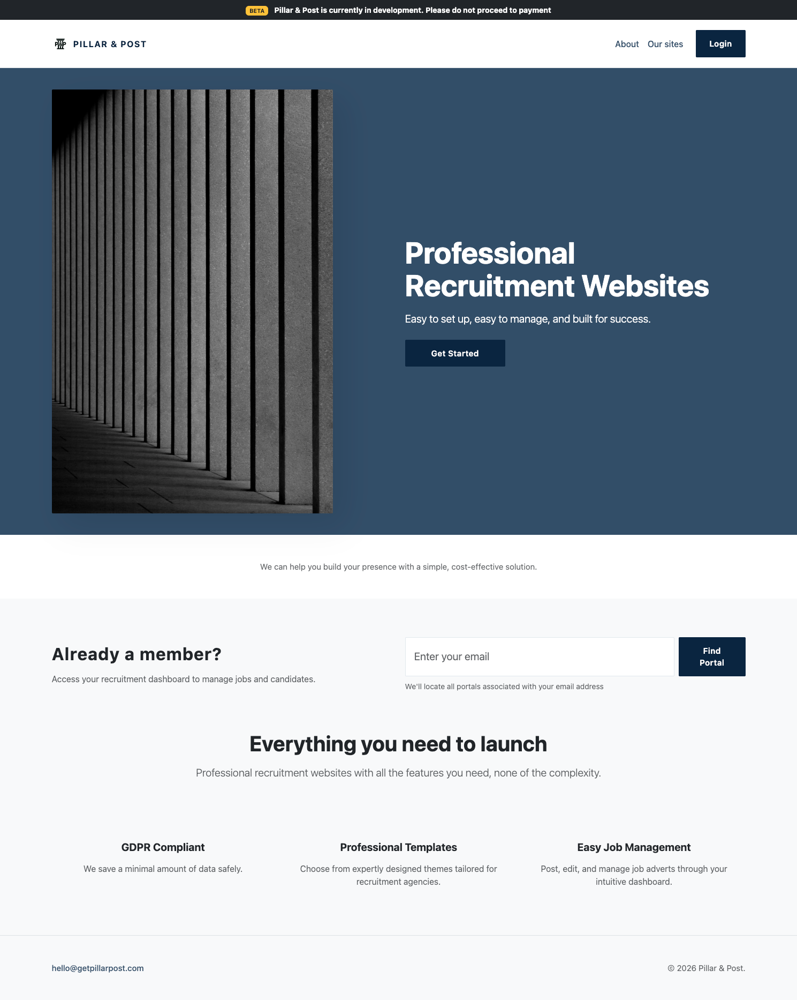

A multi-tenant SaaS platform enabling small recruitment companies to launch and manage professional websites with secure schema-level data isolation.

**Tech Stack:** Django, Django-Tenants, PostgreSQL (Neon), Stripe, Cloudinary, Brevo, Heroku  
**Live Site:** https://www.getpillarpost.com

## Concept of Website

This site is built for small recruitment comapanies/invdividuals who want professional, industry taloired websites quickly and in a cost effective manor.

- You can publish job adverts quickly
- It is designed with data safety as a priority
- It has multi-tenant architecture with different subdomains and seperate schemas
- Tenants can pick from 3 themes and invidualise their sites.

 Recruitment companies are often launched by people working on their own or in a very small team and they build on a few industry relationships to grow. This is talked about in this article, https://www.recruiter.co.uk/depth/2025/07/flying-solo "there were 31,247 recruitment enterprises in the UK at the start of 2024, with micro businesses (those with fewer than 10 employees) accounting for 78.6% of the workforce." There is a real opportunity to tap in to that market with a simple, low cost product.

### User Stories

#### Core Platform (MVP)

| ID | User Story | Outcome | Feature(s) | Priority | Status |
|----|------------|-------------------|------------|----------|--------|
| US1 | As a recruiter launching a new agency, I want to choose from professional templates so that I can quickly create a credible website which fits my client's industry. | Fast website launch without design skills. | 3 selectable templates | Must Have | Complete |
| US2 | As a recruiter, I want to customise colours so that my website reflects my brand identity. | An individual looking website | Colour picker + contrast checker | Must Have | Complete |
| US3 | As a recruiter, I want to edit website text and images so that I align with our company ethos | Personalised and credible content. | Text editors + image uploaders | Must Have | Complete |
| US4 | As a recruiter, I want to upload and edit job adverts easilyand quickly. | Accurate and competitive job postings. | Job editor (limit 6) | Must Have | Complete |
| US5 | As a recruiter, I want a dashboard to manage my site and subscription so that I don’t need technical knowledge. | An easy to use central dashboard | Tenant dashboard | Must Have | Complete |
| US6 | As a recruiter, I want secure login tied to my subdomain so that my data remains isolated. | Websites built on seperate schemas. | Subdomain routing + authentication | Must Have | Complete |
| US7 | As a recruiter, I want candidate applications forwarded via email only so that I minimise GDPR risk. | No candidate data stored in database. | Email forwarding system | Must Have | Complete |
| US8 | As a recruiter I want to ensure that my payment details are kept securely | Secure subscription management. | Stripe integration | Must Have | Complete |
| US9 | As a recruiter, I want a free trial so that I can test the platform before committing. | A good motivator to try, no card use | 14-day trial | Must Have | Complete |

#### Compliance & Security

| ID | User Story | Meaningful Outcome | Feature(s) | Priority | Status |
|----|------------|-------------------|------------|----------|--------|
| US10 | As a platform owner, I want tenant data separated at schema level so that cross-tenant data access risk is reduced. | Improved data isolation and compliance posture. | Django Tenants schema separation | Must Have | Complete |
| US11 | As a recruiter, I need to include data/privacy policies so that I remain legally compliant. | GDPR transparency. | Policy page support | Should Have | Planned |

#### Growth & Scaling

| ID | User Story | Meaningful Outcome | Feature(s) | Priority | Status |
|----|------------|-------------------|------------|----------|--------|
| US12 | As a recruiter, I want to use my own domain so that my brand appears independent. | Increased professionalism and brand trust. | Custom domain support | Should Have | Planned |
| US13 | As a recruiter managing high volumes of roles, I want to post more than 6 jobs so that my site scales with my business. | Scalability for growing agencies. | Premium tier (unlimited jobs) | Could Have | Planned |
| US14 | As a recruiter, I want to save draft jobs so that I can publish them later. | Improved workflow flexibility. | Draft job saving | Should Have | Planned |
| US15 | As a returning user, I want to easily locate my login portal so that I can access my site quickly. | Reduced login friction. | Email portal finder | Should Have | Complete |

#### Enhancements & Future Roadmap

| ID | User Story | Meaningful Outcome | Feature(s) | Priority | Status |
|----|------------|-------------------|------------|----------|--------|
| US16 | As a recruiter, I want to customise fonts so that my website feels unique. | Increased branding flexibility. | Font changer | Could Have | Planned |
| US17 | As a recruiter, I want AI assistance writing job adverts so that I save time. | Improved efficiency. | AI writing helper | Won’t Have (Yet) | Future Consideration |

## Aesthetic Design

The nature of this site means that there tangibly different design aesthetics involved, one for the marketing site for Pillar and Post and 3 different ones for the 3 different tenant themes.

The marketing site is designed to be trustworthy, conservative and give the idea of a solid foundations. I've used understated colours and fonts and included photos of buildings, going for the pillar and post theme. The idea is that it is the pillar supporting the client's websites/growth.

I'm going to concentrate on the aesthetic choices for the marketing site here, although I will add notes about the default choices the tenants are given.

### Colour Pallette

The colour scheme is simple and understated, designed to look trustworthy and modern. It is saved in css variables - 

:root {
    /* Brand Identity */
    --primary-color: #0A2540;
    --secondary-color: #334E68;
    --accent-color: #2E5C8A;
    --main-bg: #ffffff;
    --alt-bg: #F0F4F8;
    --main-text: #1a1a1a;
    --muted-text: #627D98;
    --border-stroke: #e1e8ed;
    --sharp-radius: 2px;
}

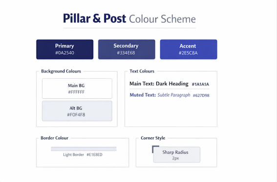

* Image created by Chatgpt

There are default colours chosen for each tenant - these are designed to look different on the template choices, but the tenants can change the primary colour (shown as a hero background), text colour and background colour to their choices. For ease, they are given a text colour that matches their primary ccolour/hero background when they are first generated

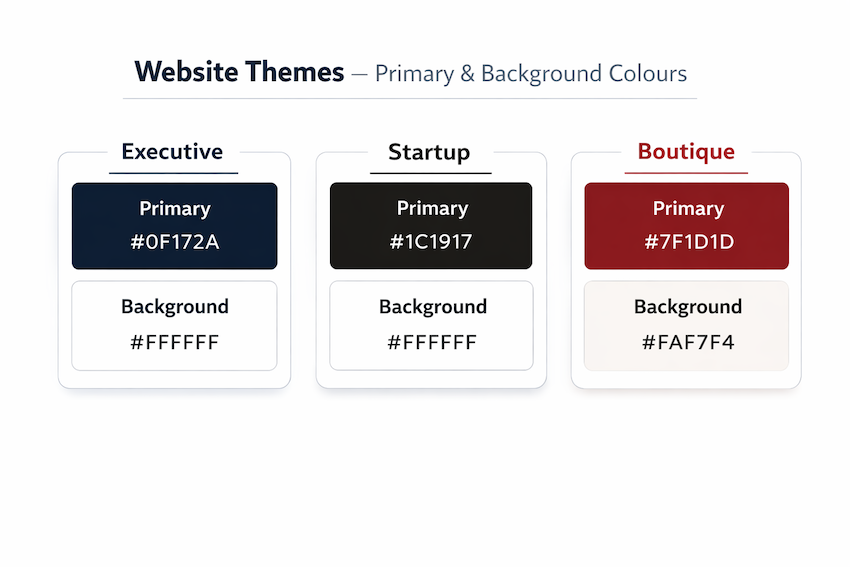

* Image created by Chatgpt

### Font Choices

The font choice for **marketing** is designed to be easily readable and simple. It uses Inter from [Google Fonts](https://fonts.google.com/).

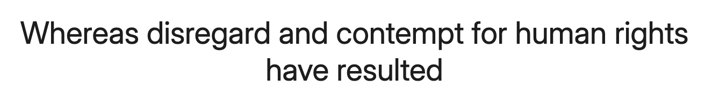

The tenants have been given fonts designed to match their style of site.

The **Exexcutive** theme uses Inter font

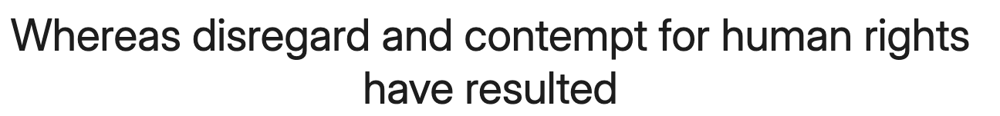

The **Startup** theme uses 

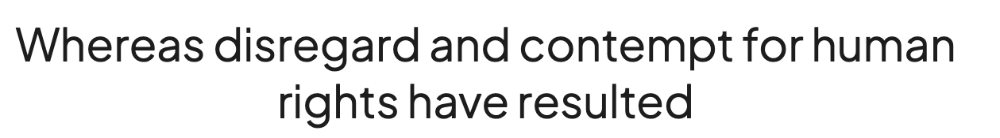

The **Boutique** theme uses Playfair Display font

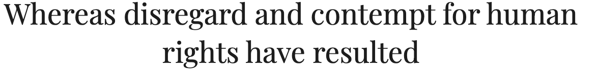

### Wireframes

#### Public Site
- [Landing Page Wireframe](docs-images/wireframes/wireframe-landing.png)
- [About Page Wireframe](docs-images/wireframes/wireframe-about.png)
- [Template Chooser Wireframe](docs-images/wireframes/wireframe-template-choice.png)

#### Logged On Tenant Site
- [Dashboard Wireframe](docs-images/wireframes/wireframe-dashboard.png)
- [Site Editor Wireframe](docs-images/wireframes/wireframe-editor.png)
- [Manage Jobs Wireframe](docs-images/wireframes/wireframe-manage-jobs.png)
- [Job Detail Wireframe](docs-images/wireframes/wireframe-job-detail.png)

#### Tenant's public Sites
- [Tenant Home Wireframe](docs-images/wireframes/wireframe-tenant-home.png)
- [Tenant About Wireframe](docs-images/wireframes/wireframe-tenant-about.png)
- [Tenant Jobs Wireframe](docs-images/wireframes/wireframe-tenant-jobs.png)
- [Tenant Job Detail Wireframe](docs-images/wireframes/wireframe-tenant-job-detail.png)

### Accessibility

Aceessibility has been thought about a great deal during design for this site. See the Lighthouse and Wave reports in Testing.md for the results in the marketing and tenant dashboard sites.

For the tenant's websites it is difficult to enforce accesiblilty rules when they can pick their own colours, so there are 2 features which help. Hero text on their sites is automatically flipped between black and white depending on the bakcground it is on

There is also a contrast checker to show the tenant's if their text colour is readable against their backgrounds. Both of these features use the YIQ formula to calculate contrast.

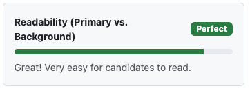

## Technical Design 

## Technologies used, and why

I have tried to put together a tech stack that is future proof for trying to launch this product. There are quite a lot of compatability issues, which should be explained if any other developers wanted to work on this project. These are outlined, along with the different technical choices, below.

### Django Tenants

This allows companies to use their own subdomains. Eventually, if the site goes live they should be able to transfer these to bespoke domains.

It is also secure because it holds data in different schemas, meaning that leaks between different clients are less likely. Recruitment companies are very data concious because they need to be able to show they are GDPR compliant legally. Data security still needs careful attention through the site, but this is helpful to attaining a secure site.

There are quite a lot of 'quirks' in the coding, things that help this system work. These are marked with notes in the code to stop accidental deletions in the future.

### Stripe

Stripe was selected because they handle all of payment, including sensitive data. It handles the subscriptions automatically. It handles all the payments data meaning P&P doesn't need a record. This is inline with the ethos of only saving necessary data.

### Cloudfayre

The domain www.getpillarpost.com was purchased through Couldfayre. They use a domain licensing system that makes the subdomains quite simple and immediately able to use. Heroku does have this option, but at a far more expensive tier.

I needed to buy a domain for this project becuase deploying via a heroku domain wouldn't support the subdomains. 

### Cloudinary

Cloudinary is used to store pictures that the tenants upload. Pictures for the marketing site and default pictures for the site editor are stored locally. It was selected because their resizing is user firendly, although there are size limits written in to this project for images to stop storage getting too filled up and keep things running smoothly.

### Neon for Postgres DB        

This is set up on the free tier, Django Tenants doesn't work with SQL Lite, so I needed to set up a compatible database. Note for Tenants to work the database needs to be unpooled - pooling means that there are always connections open which are shared, while this speeds up use and keeps it cheaper but isn't compatible with how Django Tenants locks down different schemas.

### Brevo for Email Provider

Chosen because they have a good free tier (300 emails per day) and integrates well with heroku. It is used to send emails on sign up including the user's unique subdomain and emails related to payments. This has been combined with Zoho to run the inbox for hello@getpillarpost.com using a free tier.

### Other choices 

After some consideration I have decided not to use a Celery/Redis helper or similar at the moment. There is a risk at the moment that a user could spend longer than is ideal waiting for an error message if something goes wrong in the Stripe process or email processes, but I don't want to add the complexity to the the app at the moment. Having researched it sounds like it is quite difficult to get these things to work with a Django Tenants set up.

This is something I intend to add later.

Everything else is listed in my requirements.txt. My current one is below, but if working on the project the most recent version should be checked (this is written in code to be easily adjustable)

asgiref==3.11.0
certifi==2026.1.4
charset-normalizer==3.4.4
cloudinary==1.44.1
crispy-bootstrap5==2025.6
dj-database-url==3.1.0
Django==5.2.9
django-cloudinary-storage==0.3.0
django-crispy-forms==2.5
django-tenants==3.9.0
gunicorn==25.0.3
idna==3.11
packaging==26.0
pillow==12.1.0
psycopg2-binary==2.9.11
python-dotenv==1.2.1
requests==2.32.5
six==1.17.0
sqlparse==0.5.5
stripe==14.1.0
typing_extensions==4.15.0
urllib3==2.6.2
whitenoise==6.11.0

## User Journeys

The journey is designed to be simple, but there is stage when a user needs the middleware to switch to their subdomain. That is either done by using the portal finder feature or going straight to their subdomain. When signing up the subdomain login page appears immediately after the signup is completed. I've used javascript to help the forms remember email addresses so people don't have to enter them twice in quick succession.

### New User Sign up Flow

### Returning User Sign in Flow

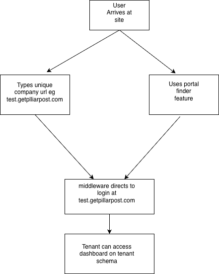

## Features

### Email Portal Finder
This feature is on the landing page of the marketing site. If someone is already a user it allows them to be redirected to the correct subdomain for them to log in to their site. The clients will also be emailed a link to this subdomian when they sign up. Because of the subdomain logic it isn't possible just to have a login link from the homepage - the login needs to be in the correct subdomain. This means that I have included a small javascript feature to remember the email when signing in after using the portal finder.

### Client's Dashboard

This is on each client's unquie subdomain. It allows them to manage their websites, jobs and subscriptions. The client's don't have seperate admin access created for them on sign up, everything is managed from here. This was to avoid giving access to things that might cause problems with their sites.

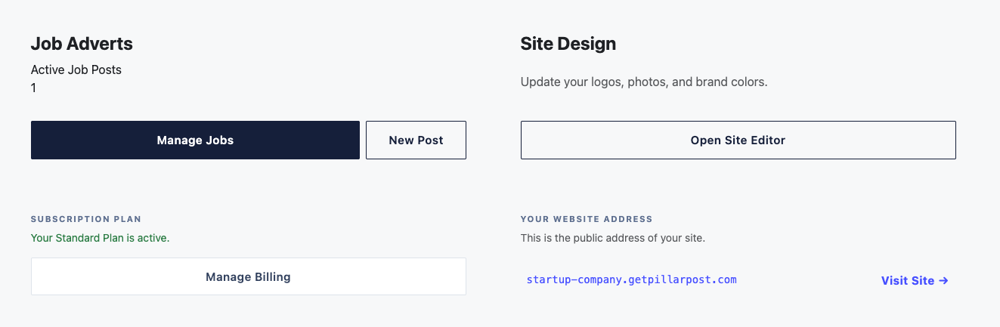

### Billings and Payments

There is a link in the dashboard to the payments section. This is all handled by Stripe. This also keeps track of whether you are on trial, subscribed or not active. Note the logic for this is handled in a bespoke middleware file which also looks at subdomain routing. It's called debud_middleware.py and sits along settings_py in the recruit_saas app.

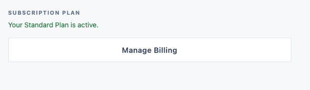

### Site Editor

This is the fun part of the site, where tenants can change text, colours and pictures on their sites.

It has a few features within it. The preview screen which allows you to see what the site looks like on desktop, tablet and mobile.

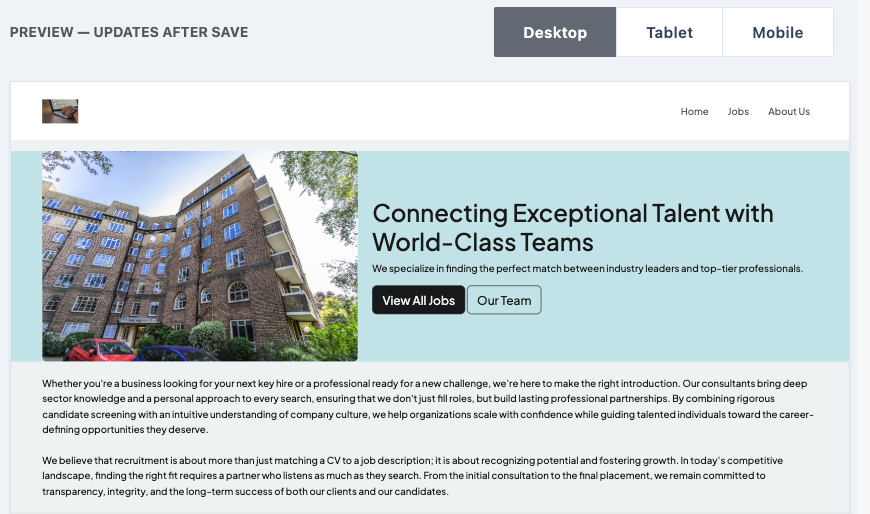

The template changer, which allows the user to easily experiment using the three different themes

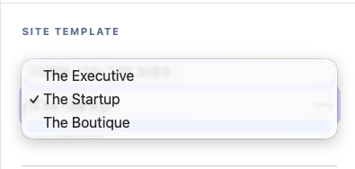

The colour picker, where users can select 3 colours for their websites and are given a contrast checker between text and background.

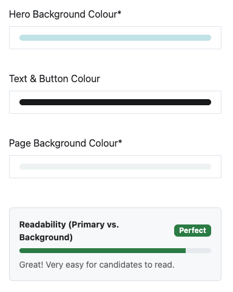

There are 3 image uploaders, for the logo, the hero picture and the about picture. These have a small preview area.

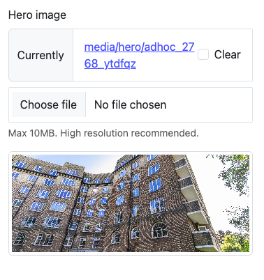

There are various text input areas. These have character counters and guides for how much text to write to help the sites look balanced.

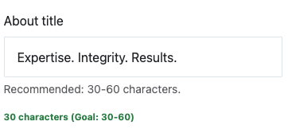

#### Job Editor
This is a key feature and the selling point for the site. It is simple to use, and allows the user to enter up to 6 jobs on the standard payment tier.

This part of the site allows the users to upload their job adverts, as well as editing and deleting ones that are already uploaded.

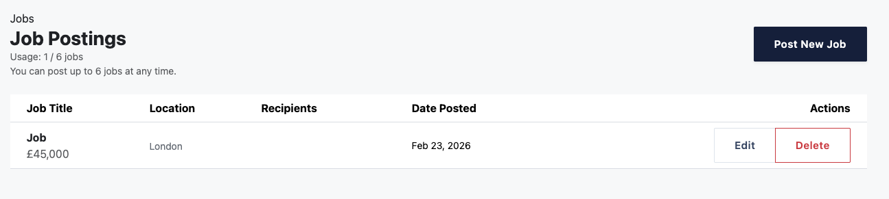

#### Live site viewer
This opens the client's live site on their P&P subdomain in a new tab, so they don't lose their place on the dashboard.

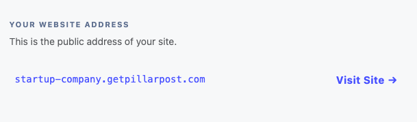

### Email Send features 
Emails are sent when people signup, which includes there unique url for login. Emails are also sent when subscriptions are set up.

### A note on file setup.

Making a multi tenant app means that the file setup is a bit different from standard Django. There are 3 base.html files - 1 standard one for the marketing site, 1 dashboard one for when a tenant is signed and 1 tenant one for the sites they design. The CSS files mirror this set up and they are stored in the appropriate Django Apps. There are 3 apps - marketing (for the marketing site), CMS which handles everything for the clients when they are logged in and the customers app, which handles payment and management info. This is for the owner of P&P to use.

## Data Design

A key point in the ethos of the site is to retain as little data as possible.

This site uses seperate schemas for each tenant to try and maintain the best security and stabiltiy.

There is a model for each client/tenant. This holds information about payment and trials etc

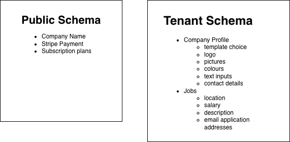

Within their schema there is a company profile model, which holds information for their webiste (ie pictures, text etc that they have created.)

Within their schema there is also a model for each job. This holds information about the individual jobs they post as adverts.

The way they are linked is slightly different to a standard Django app because the job and profile model's only exist within the company's individual schemas. 

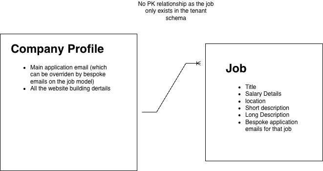

## Persistant Bugs and Known Issues

Most of the bugs I encountered while working on this project were due to a lack of experience in working with multi tenant sites. 

### 404 and 403s caused by multitenancy

Getting a 404 error when trying to hit a subdomain, because django's middleware didn't use the correct url file (it kept hitting the one at the root rather than the one in the marketing app). This was solved with some bespoke middleware which helped Django with the routing.

Another subdomain issue is getting 403 errors when trying to get to the dashboard/properly looged on. Once I got deeper and understood what is and isn't allowed in multitenant apps these stopped.

The subdomains also caused lots of complications while putting together tests, these took a great deal of persistence, you need to be very rigid about not jumping between the public and tenant domains.

### PKS on Jobs

Initilly I had creaeted the job model with a PK to the company. This is unnecessary because the job only exists within the tenant schema. This lead to a persistent errors and crashes because they couldn't delete the jobs associated with a tenant when I was trying to clean up the database or clean the database for testing.

## Credits, Articles and Blogs

https://testdriven.io/blog/django-multi-tenant/
https://django-tenants.readthedocs.io/en/latest/install.html 
https://github.com/django-tenants/django-tenants/issues/28 
https://pypi.org/project/Django-Subdomain-Middleware/
https://lincolnloop.com/blog/user-generated-themes-django-css/
https://www.youtube.com/watch?v=_wefsc8X5VQ

## Photo credits

unsplash.com
'executive': 'Photo by <a href="https://unsplash.com/@alesiaskaz?utm_source=unsplash&utm_medium=referral&utm_content=creditCopyText">Alesia Kazantceva</a> on <a href="https://unsplash.com/photos/turned-off-laptop-computer-on-top-of-brown-wooden-table-VWcPlbHglYc?utm_source=unsplash&utm_medium=referral&utm_content=creditCopyText">Unsplash</a>
      
'startup': 'Photo by <a href="https://unsplash.com/@suryadhityas?utm_source=unsplash&utm_medium=referral&utm_content=creditCopyText">Suryadhityas</a> on <a href="https://unsplash.com/photos/a-room-filled-with-lots-of-desks-and-computers-NrDZJ9oWV_Y?utm_source=unsplash&utm_medium=referral&utm_content=creditCopyText">Unsplash</a>
      
'boutique': Image by <a href="https://pixabay.com/users/pexels-2286921/?utm_source=link-attribution&utm_medium=referral&utm_campaign=image&utm_content=2181960">Pexels</a> from <a href="https://pixabay.com//?utm_source=link-attribution&utm_medium=referral&utm_campaign=image&utm_content=2181960">Pixabay</a>

About us preview Image by <a href="https://pixabay.com/users/markusspiske-670330/?utm_source=link-attribution&utm_medium=referral&utm_campaign=image&utm_content=581131">Markus Spiske</a> from <a href="https://pixabay.com//?utm_source=link-attribution&utm_medium=referral&utm_campaign=image&utm_content=581131">Pixabay</a>

hero image Photo by <a href="https://unsplash.com/@cecilecos?utm_source=unsplash&utm_medium=referral&utm_content=creditCopyText">Cécile</a> on <a href="https://unsplash.com/photos/a-black-and-white-photo-of-a-wall-VgyM77QmzHo?utm_source=unsplash&utm_medium=referral&utm_content=creditCopyText">Unsplash</a>
      
About us P&P Photo by <a href="https://unsplash.com/@albrb?utm_source=unsplash&utm_medium=referral&utm_content=creditCopyText">Alejandro Barba</a> on <a href="https://unsplash.com/photos/grayscale-photo-of-concrete-building-L6lqXDt_WuI?utm_source=unsplash&utm_medium=referral&utm_content=creditCopyText">Unsplash</a>

default about us Photo by <a href="https://unsplash.com/@essentialprints?utm_source=unsplash&utm_medium=referral&utm_content=creditCopyText">James Healy</a> on <a href="https://unsplash.com/photos/aim-high-fly-higher-photo-frame-WZ-YnvCCLug?utm_source=unsplash&utm_medium=referral&utm_content=creditCopyText">Unsplash</a>
      
Favicons made at [www.favicon.io](https://favicon.io/)

Colour scheme diagrams created by [ChatGPT](https://chatgpt.com/)

Wireframes made on [Excalidraw](https://excalidraw.com/)

Data diagrams made on [draw.io](https://www.drawio.com/)

## Notes on Development

I tried to approach this project with a 'real world' mindset, so I have tried to write the documentation and notes in the code in such a way that other developers could use it to work on the project. This is a more complex tech stack than I have used before, with more 'moving parts' - pressing the wrong button or deleting the wrong bit of code can cause lots of problems! Therefore notes have had to be better.

Using a multidomain site bought challenges I hadn't necessarily anticipated, such as having to buy a domain because Heroku doesn't support this type of set up. 

I also changed my thinking on aesthetics quite seriously from the beginning of development to the end, this was to make the tenant themes more tangibly different when you viewed them. I feel that this is something experience will help with, being able to picture the design concept better when it is actually developed.

## Future Considerations

### Premium Tier

The intention is to introduce 3 tiers. One, fairly cheap minimal one where people use their P&P subdomian. A standard tier, where people use their domain and have their own favicons, but a limit of 6 jobs. The premium tier would have unlimited jobs, with a search function on that page. I'm also considering building an AI 'helper' for the recruiters to help them write their job adverts. The company profile model is ready for new plans to be added, at the moment everyone starts on 'on_trial' and there is a 'standard' plan.

### Data Structure Requirements

It would be good to adjust the edit site feature so that everything wasn't saved to the database and also make sure that things are deleted cleanly after they are no longer being used on the site. A way to do this would be to make a proper preview window that you could build, before saving in a way that affected the live site and saved to the database.

At the moment database storage limits have to be looked at manually, but I'd like a way to automate that.

### Celery/Redis

The site runs email sends at signup, payment and email applications. As these are running it would be useful to have an asynchronous worker so that it was more seamless for users and to avoid any errors, this is something I intend to do, but needs careful development to work with Django Tenants.

### Site Editor

There are endless ways this could be improved - more pages, more editable areas including page titles, more themes, more pictures. It could also do with a better text editor.

This is never ending, but I believe I have produced a minimum viable product.

## Deployment Steps

It is worth noting that I did most of my testing and development steps using the deplyed site because it acted quite differently to when I was using it locally, mostly because of the subdomain logic. Therefor my commit history on this site is extensive!

This site is not difficult to deploy as long as steps are followed closely. 

All changes and updates are stored on github .

It is deployed via Heroku.

All environment variables must be stored in .env and heroku config vars. As the project has a few dependencies there are a few to include

Cloudinary
CLOUDINARY_API_KEY
CLOUDINARY_API_SECRET
CLOUDINARY_CLOUD_NAME

Database
DATABASE_URL
HEROKU_POSTGRESQL_TEAL_URL

Email
DEFAULT_FROM_EMAIL
EMAIL_HOST_PASSWORD
EMAIL_HOST_USER

Stripe
price_id_standard
product_id
STRIPE_PUBLIC_KEY
STRIPE_SECRET_KEY
STRIPE_WEBHOOK_SECRET

Django
SECRET_KEY

You also need to have a couple of files saved in the base of the project.

A Procfile (just called 'procfile,' no .py or similar) which contains this code. This runs a migration each time a deployment is run, and some of the code is necessary for Django Tenants. 

release: python manage.py migrate_schemas
web: gunicorn recruit_saas.wsgi --log-file -

You also need a .python-version (again no .py or similar) which just contains the version for Heroku. Mine simply says 

3.12

Once all these are set you can either deploy while syncing to github (providing you have set this up locally) byt using the commands

git add .
git commit -m 'commit message'
git push heroku main

Or you can deploy via the heroku app, which you need to link to the github repo. 

### Cloning Code from the repo

In order to undertake any work on the site the code can be cloned locally from github. The url to do this is [github code url](https://github.com/christinalicence/recruitment_saas.git). You can enter this to link on the home page of VSCode to clone it.

This project was set up in a virtual environment (.venv), with all the dependencies listed in requirements.txt. The API keys, secret keys and database url are all in my gitignore and heroku's config vars.

NOTE: You can access the logs for error checking in the app or via your local machine with the command 
heroku logs --tail

## Testing

See TESTING.MD file.
