# Testing Pillar & Post

## Testing Objectives Against User Stories

I have tried to test all the parts of the website that are fundamental to data privacy or functioning through automated testing. I have used manual testing to test the aesthetic touches.

| ID | User Story | Outcome | Feature(s) | Tested |
|----|------------|---------|------------|--------|
| US1 | As a recruiter launching a new agency, I want to choose from professional templates so that I can quickly create a credible website which fits my client's industry. | Fast website launch without design skills. | 3 selectable templates | Tested by test_pages_load.py |
| US2 | As a recruiter, I want to customise colours so that my website reflects my brand identity. | An individual looking website | Colour picker + contrast checker | Tested Manually |
| US3 | As a recruiter, I want to edit website text and images so that I align with our company ethos | Personalised and credible content. | Text editors + image uploaders | Tested Manually |
| US4 | As a recruiter, I want to upload and edit job adverts easily and quickly. | Accurate and competitive job postings. | Job editor (limit 6) | Tested Manually and in test_firm_data_isolation.py |
| US5 | As a recruiter, I want a dashboard to manage my site and subscription so that I don't need technical knowledge. | An easy to use central dashboard | Tenant dashboard | Tested Manually and in test_dashboard_requires_login.py |
| US6 | As a recruiter, I want secure login tied to my subdomain so that my data remains isolated. | Websites built on separate schemas. | Subdomain routing + authentication | Tested in test_authenticated_user_can_access_own_dashboard.py, test_unauthenticated_request_is_blocked.py and test_sessions_are_scoped_to_tenant_schema.py |
| US7 | As a recruiter, I want candidate applications forwarded via email only so that I minimise GDPR risk. | No candidate data stored in database. | Email forwarding system | Tested in test_emails.py |
| US8 | As a recruiter I want to ensure that my payment details are kept securely. | Secure subscription management. | Stripe integration | Tested in test_checkout_session_redirection.py, test_webhook_payment_success_activates_client.py and test_webhook_payment_failure_deactivates_client.py |
| US9 | As a recruiter, I want a free trial so that I can test the platform before committing. | A good motivator to try, no card needed. | 14-day trial | Tested in test_trial_and_plan.py |
| US10 | As a platform owner, I want tenant data separated at schema level so that cross-tenant data access risk is reduced. | Improved data isolation and compliance posture. | Django Tenants schema separation | Tested in test_firm_data_isolation.py and test_sessions_are_scoped_to_tenant_schema.py |
| US11 | As a recruiter, I want to produce an accessible and usable website with little technical knowledge. | Improved accessibility compliance. | Contrast checker and accessibility testing | Tested Manually |
| US15 | As a returning user, I want to easily locate my login portal so that I can access my site quickly. | Reduced login friction. | Email portal finder | Tested in test_portal_finder.py |

## Manual Testing

### Code Validators

#### HTML Validator

With Django htmls it is easier to enter the urls at the [W3C](https://validator.w3.org/) validator. It has trouble reading the tags if you put the whole files in. 

It gave me 1 warning on the landing page

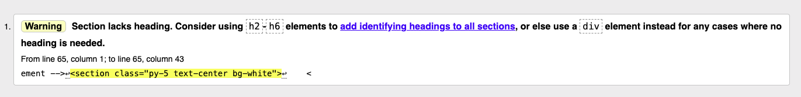

I changed the section to a div as advised by the warning.

Everything else passed in the marketing site and the dashboard area.

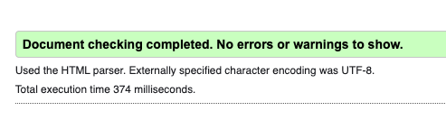

My tenant sites had a small issue, one left over tag and a warning about header orders, caused by using Bootstrap cards and not reordering my headings.

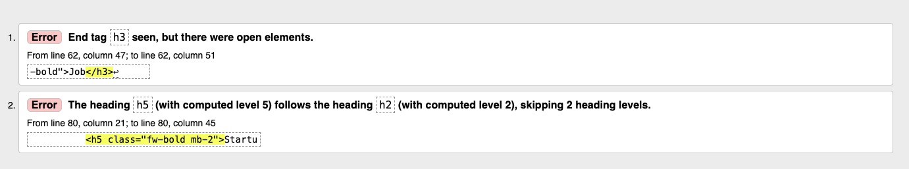

I fixed these issues, then everything passed.

#### CSS VAlidator

I passed all 3 CSS files through the [W3C](https://jigsaw.w3.org/css-validator/validator) validator. There is 1 in the marketing app and 2 in the cms app.

All of them passed with no issues.

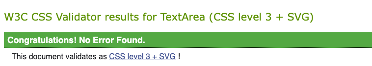

#### Javascript Linter

I used [JSHint](https://jshint.com/) to test all my javascript files. It had some warnings, but they were all to do with using more modern javascript and safe to ignore.

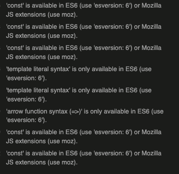

#### Python Standards

I have used Flake8 to help me keep my Python code inline with PEP8 standards.

I have used a few helpers to get my code through, there is a .flake8 file in my base with the following code

# E501 = Line too long
# W291 = Trailing whitespace (end of lines)
# W391 = Blank line at end of file
# F841 = Local variable assigned but never used (e.g. in tests)
ignore = E501, W291, W391, F841
max-line-length = 120
exclude = .git,__pycache__,migrations,venv

This is allowing me longer lines, which I find easier to work with and allowing local variables, which I had in testing and would cause problems if I removed. I did include blank lines at the end of the files and trialing whitespace, but I have gone through the file and fixed all of those errors.

## Features Testing

| Feature | Category | Method | Test Case / Logic | Status |
| :--- | :--- | :--- | :--- | :--- |
| 3 Selectable Templates | UI/UX | Automated | test_pages_load.py confirms views resolve correctly for different template paths. | PASS |
| Colour Picker + Contrast | Accessibility | Manual | Background/Text contrast checked using hero-contrast.js and manual visual inspection. | PASS |
| Text & Image Editors | Content | Manual | Verified that CompanyProfile model updates successfully save and render on the tenant site. | PASS |
| Job Editor (Limit 6) | Logic | Automated | test_firm_data_isolation.py ensures jobs are correctly associated and restricted by tenant. | PASS |
| Tenant Dashboard | Security | Automated | test_dashboard_requires_login.py ensures unauthorized users cannot access tenant settings. | PASS |
| Subdomain Routing | Infrastructure | Automated | test_pages_load.py verifies the public vs. tenant middleware routing logic. | PASS |
| Stripe Integration | Billing | Manual | Checked webhook responses and Client model status updates after successful Stripe checkout. | PASS |
| Schema Isolation | Security | Automated | test_firm_data_isolation.py verifies that SQL queries are restricted to the active schema only. | PASS |
| Application Emails | Communication | Manual | Sent test applications to verify Brevo routes to custom_recipient_1 when specified. | PASS |

### Colour Picker Test

These pictures show the primary/hero colour changer working

### Text & Image updaters

This text editor changes the sub hero text

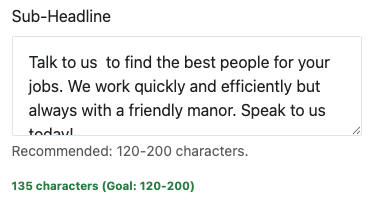

The text it renders

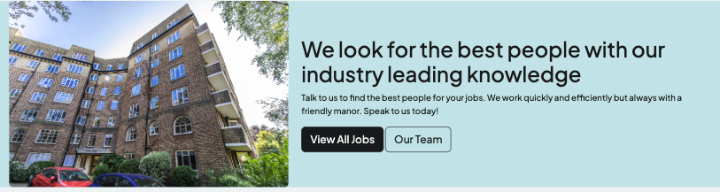

### Maunal Stripe Checks

Stripe paymeents are handled successfully

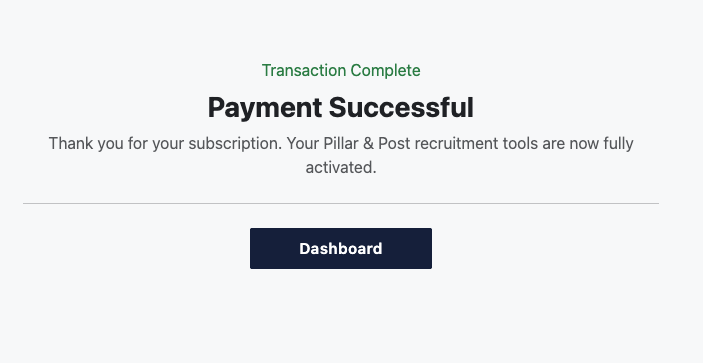

The 200 in the logs showing the webhook worked

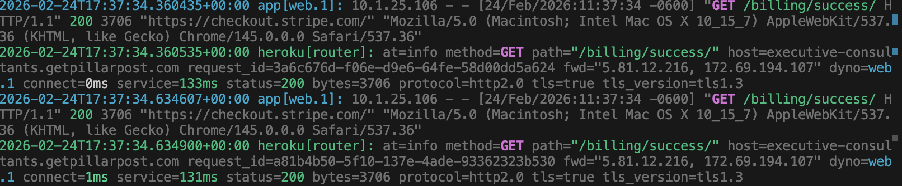

The Stripe dashboard showing the payment

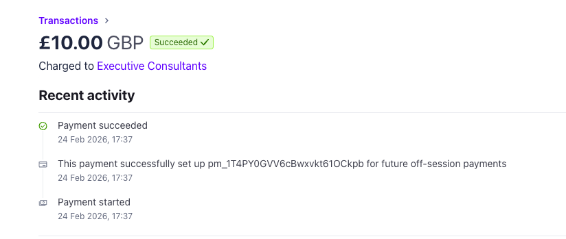

### Email Checks

I have tested the email for subscription, payment and applications manually. This is the sign up email.

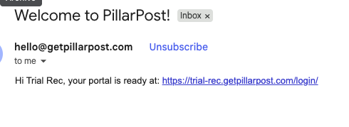

### Responsiveness

This site was built using Bootstrap grids and navbars, so it naturally worked responsivley. This is also true for the tenant's live sites. One of the feautures of the site editor is that the tenants can see how their sites work on desktops, tablets and mobiles.

The site editor didn't work brilliantly on mobile, so it is hidden on smaller screen formats and a message is shown to the user

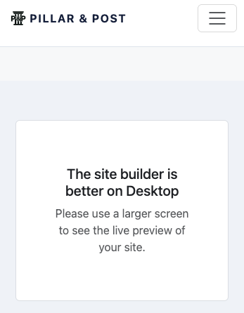

Below are links of the marketing site being responsive

[Landing Page Reponsive](docs-images/responsive-shots/responsive_landing.png)
[About Page Reponsive](docs-images/responsive-shots/about_responsive.png)
[Templates Page Reponsive](docs-images/responsive-shots/templates_responsive.png)

Here are the tenant dashboard pages

[Tenant Dashboard Page Reponsive](docs-images/responsive-shots/dashboard_responsive.png)
[Edit Site Page Reponsive](docs-images/responsive-shots/site_editor_responsive.png)
[Job Editor Page Reponsive](docs-images/responsive-shots/job-editor-responsive.png)

And here are the tenant live sites

[Tenant Home Page Reponsive](docs-images/responsive-shots/tenant_home_responsive.png)
[Tenant About Page Reponsive](docs-images/responsive-shots/tenant_about_responsive.png)
[Tenant Jobs Page Reponsive](docs-images/responsive-shots/tenant_jobs_responsive.png)

## Accessibility

Accessibility is difficult to maintain when you are giving tenants control of their own colour scheme. There are 2 gaurds in place to help. There is the javascript function which toggles the hero text between black and white in order to contrast with the primary colour

There is also the colour contrast checker

All pages have also been checked with Lighthouse and Wave.

### Lighthouse

Most of the Lighthouse reports were strong passes

But it did bring up a couple of points. I needed to add specific height and width to the images on my Landing page and About page on the marketing site to improve performance.

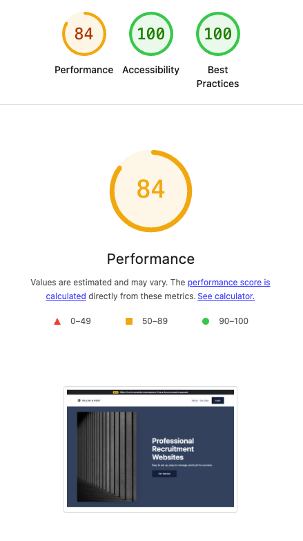

These were fixed when I did this.

It's worth noting that Cloudinary does resize pictures when the tenants upload them, but I'm not sure if this is a complete fix for never getting Lighthouse errors.

### Wave Testing

## User Testing

The first round of user testing found a few bugs. 

- If you had an error during sign up it would fail silently

- If you visited a tenant's live page and tried to open a job advert to see the detail you got a 404 error.

It also uncovered a frustration with the sign up process because you entered your details to create your account, but the login page that followed (while being integral to how the site works because it routes to the subdomain) was annoying because you had to reenter all your details.

All of these were fixed by code improvements.

The second round of user testing went well, with no particular feedback.

## Automated Testing

I have tried to be as thorough as possible with automated testing, mainly to future proof the site. I ran in to lots of issues with the domain routing which meant that tests were harder to write, but through persistance I am happy with the coverage.

These are the automated tests that haven't been described elsewhere. They mostly deal with data security.

| Test | File | What It Tests | Result |
|------|------|---------------|--------|
| test_authenticated_user_can_access_own_dashboard | test_dasboard_security.py | An authenticated user receives a 200 response on their own tenant's dashboard | PASS |
| test_unauthenticated_request_is_blocked | test_dasboard_security.py | An unauthenticated request to the dashboard is redirected to login (302) and not served | PASS |
| test_sessions_are_scoped_to_tenant_schema | test_dasboard_security.py | A session created in tenant A's schema cannot be read in tenant B's schema — the core cross-tenant isolation mechanism | PASS |
| test_dashboard_requires_login | test_dashboard_access.py | An unauthenticated request to the dashboard URL returns a 302 redirect | PASS |
| test_firm_data_isolation | test_tenant_isolation.py | Jobs and profile data created in one tenant's schema cannot be queried from another tenant's schema | PASS |
| test_auto_schema_name_generation | test_tenant_models.py | A new tenant automatically generates a schema name from the company name | PASS |
| test_unique_slug_collision_handling | test_tenant_models.py | If a schema name already exists, a unique suffix is appended to avoid collisions | PASS |
| test_checkout_session_redirection | test_billing.py | Initiating checkout creates a Stripe session and redirects to the Stripe payment URL | PASS |
| test_webhook_payment_success_activates_client | test_billing.py | A valid checkout.session.completed webhook sets the tenant's is_active flag to True | PASS |
| test_webhook_payment_failure_deactivates_client | test_billing.py | A valid invoice.payment_failed webhook sets the tenant's is_active flag to False | PASS |
| test_signup_sends_welcome_email | test_emails.py | A welcome email containing the tenant's unique portal URL is sent to the admin email on signup | PASS |
| test_payment_success_sends_confirmation_email | test_emails.py | A confirmation email is sent to the tenant's notification email after a successful payment | PASS |
| test_payment_failure_sends_alert_email | test_emails.py | An alert email is sent to the tenant's notification email when a payment fails | PASS |
| test_portal_found_by_exact_email | test_portal_finder.py | Submitting a matching email returns the tenant's login URL | PASS |
| test_portal_not_found_shows_error | test_portal_finder.py | Submitting an unknown email renders an error message rather than crashing | PASS |
| test_email_lookup_is_case_insensitive | test_portal_finder.py | Portal finder returns the correct result regardless of email case | PASS |
| test_post_with_empty_email_does_not_crash | test_portal_finder.py | Submitting an empty email renders the form cleanly without an error | PASS |
| test_get_request_renders_form | test_portal_finder.py | A GET request to the portal finder renders the form with a 200 | PASS |
| test_email_with_leading_trailing_whitespace_still_finds_portal | test_portal_finder.py | Whitespace around the submitted email is stripped before querying | PASS |

At this point I haven't written tests for trial.

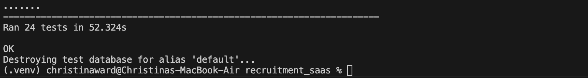

## Test Driven Development

I found this far more challenging with the subdomain environment and found that I was rewriting my tests often through the development process, but I do find this a valuable tool in terms of understanding my code and seeing potential future issues with it. 

A bug that I encountered when testing was persistent database issues - the tests couldn't run because the databases already existed, Django tries to clean the database automatically before each test run if this happens, but I kept being told there was an active user on the database and deleting it was impossible. This turned out to be an issue with having my Neon Postgres DB pooled, which means that it keeps connections open. When I changed it to unpooled this issue was fixed.
 
